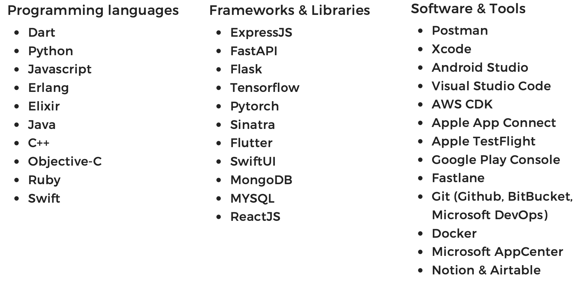

    

# 钟智强

### 关于我：

在移动应用的世界里，我编织了一幅令人心动的画卷。我的安卓和苹果应用，不仅仅满足需求，更是引领着生活方式的革新。每个应用背后都蕴藏着一个故事，它们为用户带来便捷与欢乐。我跨越了传统的界限，将技术的触角延伸到了物联网和脑机接口的前沿。我所贡献的，是一场科技的探索之旅，为人类揭示了未知的领域，开拓了潜能的无限可能。在这个充满未知的舞台上，我作为创意的领航者，指引着未来的航向。身为全栈开发者，我怀揣着征服所有技术难题的决心。每一次技术的碰撞，都是我自我挑战的舞台。我坚信，只有超越自我，才能创造出杰出的作品。我将无畏的精神注入每个项目、每行代码，让技术与激情在每个应用中交织碰撞。

计算机视觉项目是我追逐的星光。我热衷于探索技术的深邃，发现它如何赋予我们全新的感知方式。每个像素都承载着故事，它们重新定义了我们对世界的认知。我致力于让人们以前所未有的视角审视现实，感受科技带来的震撼与启迪。作为一个自我驱动的学习者，我的求知欲永不熄灭。我渴望不断成长与进步，通过持续的学习和实践，挑战自己的极限。我坚信，只有坚持不懈的努力，才能在技术领域登峰造极，让创新的火花在我的手中熊熊燃烧。

## 我掌握的技能
             

<!--

       

 

### 关注我

    

-->
