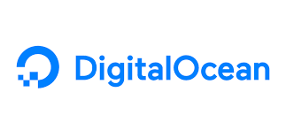

# JOHN MELODY ME
### Senior Software Engineer & Computer Vision Engineer

- I'm Currently working on `WEBRTC`    related projects and `Bluetooth Low Energy`  Projects
- I'm Looking for `Better Opportunity`  to be recognized.
- Biggest Interest is `Custom Encryption`  and `Algorithms` .
- Currently doing 3 `computer vision` project with ,   and 

 

### Fact About me:
 - I developed countless of mobile-application for both `android` and `ios` (cross-platform or native)
 - I had contribute to countless of the  internet of things and the brain-computer interface application.
 - I am a full-stack developer.
 - I am in love with `computer vision` projects 

 For more, refer to <a href="https://bio.link/johnmelodyme">https://bio.link/johnmelodyme</a> 

 

### For Hiring Me For Projects: 

&nbsp;&nbsp;&nbsp;&nbsp;&nbsp;&nbsp;
 

### See My Contributions:
 

&nbsp;&nbsp;&nbsp;&nbsp;&nbsp;&nbsp;&nbsp;&nbsp;&nbsp; &nbsp;&nbsp;&nbsp;

 

 

 

#### Join My Discord Server:

 

#### Buy me a coffee? 

 

#### Affliate Referal Links:
&nbsp;&nbsp;&nbsp;
